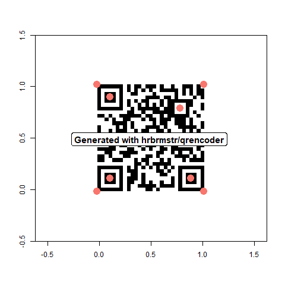

# quadrangle
R package. Wrangles QR codes from images, using Rcpp and V8.

Wraps [dlbeer/quirc (C++)](https://github.com/dlbeer/quirc) and [cozmo/jsqr (JS)](https://github.com/cozmo/jsqr).

To write QR codes, there are many online generators. Within R, there is [hrbrmstr/qrencoder](https://github.com/hrbrmstr/qrencoder).


## Installation:
```r
devtools::install_github("brianwdavis/quadrangle", INSTALL_opts = "--no-multiarch")
# You may not need `INSTALL_opts = "--no-multiarch"` depending on your system.
```

## Basic usage:


```r
library(quadrangle)
library(ggplot2)      # required for plotting
# find these test images in the /inst/ directory of the github repo
# or at system.file("<image file name>", package = "quadrangle")

qr_scan("test_original.jpg", flop = T, force_js = T, plot = T)

> $`values`
>   id         type       value
> 1  1 alphanumeric W XYZ B0 T1
>
> $points
> # A tibble: 8 x 4
>   id    corner                          x     y
>   <chr> <chr>                       <dbl> <dbl>
> 1 1     topRightCorner              208.  180. 
> 2 1     topLeftCorner               181.   29.8
> 3 1     bottomRightCorner            57.5 208. 
> 4 1     bottomLeftCorner             31.5  55.7
> 5 1     topRightFinderPattern       179   160. 
> 6 1     topLeftFinderPattern        161    59  
> 7 1     bottomLeftFinderPattern      61    76.5
> 8 1     bottomRightAlignmentPattern  96.3 152. 
```


## Multiple codes at once


```r
image_read("multiple_original.png") %>%
  qr_scan(flop = F, no_js = T, plot = T)
  
> $`values`
>   id                       value
> 1  1           in a single image
> 2  2 to detect multiple QR codes
> 3  3              This is a test
> 
> $points
>    id    x    y
> 1   1  725  845
> 2   1  810  718
> 3   1  939  798
> 4   1  852  930
> 5   2  832  968
> 6   2 1070  961
> 7   2 1077 1209
> 8   2  835 1214
> 9   3 1598 1004
> 10  3 1608 1315
> 11  3 1306 1330
> 12  3 1289 1010  
```


## Image generation

The origin of this package was a research project where the collection method was taking RGB images with a consumer point-and-shoot camera, and then using the metadata encoded in QR codes to identify samples to record in a database. To generate your own QR codes to use in images, try plotting with base or grid graphics.


```r
devtools::install_github("hrbrmstr/qrencoder")
# also on CRAN, `install.packages("qrencoder")`

png("generation_original.png")
image(
  1 - qrencoder::qrencode("Generated with hrbrmstr/qrencoder"), 
  asp = 1, xlim = c(-0.5, 1.5), ylim = c(-0.5, 1.5),
  col = c("black", "white")
  )
dev.off()
```


```r
qr_scan("generation_original.png", flop = F, plot = T)

> $`values`
>   id type                             value
> 1  1 byte Generated with hrbrmstr/qrencoder
> 
> $points
> # A tibble: 8 x 4
>   id    corner                          x     y
>   <chr> <chr>                       <dbl> <dbl>
> 1 1     topRightCorner               164.  142.
> 2 1     topLeftCorner                164.  322.
> 3 1     bottomRightCorner            344.  143.
> 4 1     bottomLeftCorner             344.  322.
> 5 1     topRightFinderPattern        186.  164 
> 6 1     topLeftFinderPattern         186.  300.
> 7 1     bottomLeftFinderPattern      322   300.
> 8 1     bottomRightAlignmentPattern  304.  183 
```



In addition to the method above, `grid::rasterGrob(<qr_matrix>, interpolate = F)` can be useful for arranging additional text on a page, so that you can include human-readable metadata as well. Note that depending on the graphics method you use to render the QR code, the matrix may be flipped or color-inverted. I recommend running a test under the lighting conditions you expect "in the wild" before you deploy a lot of them.