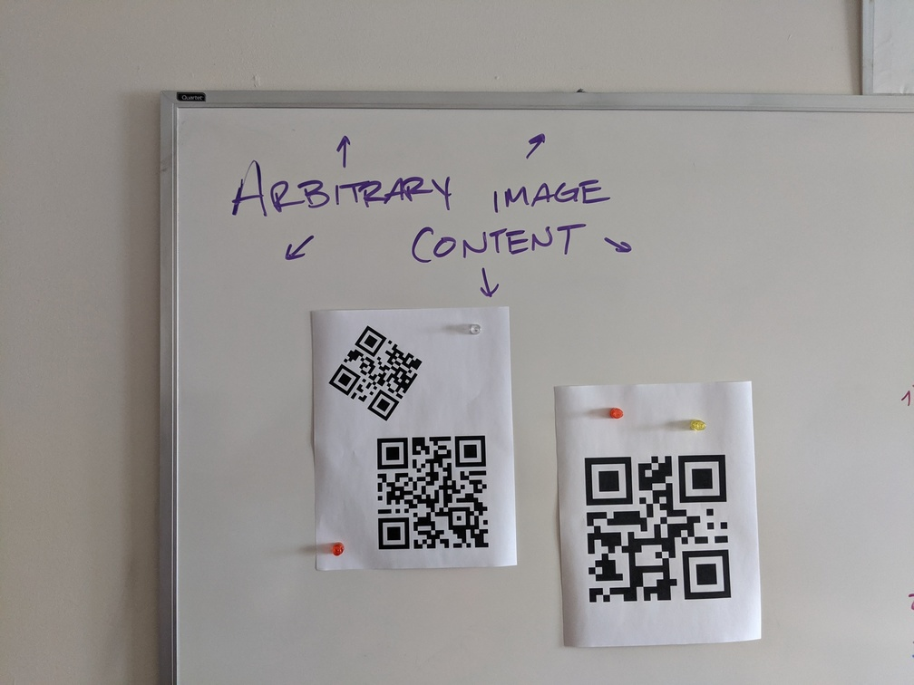

# quadrangle
R package. Wrangles QR codes from images, using Rcpp and V8.

Wraps [dlbeer/quirc](https://github.com/dlbeer/quirc) and [cozmo/jsqr](https://github.com/cozmo/jsqr).


## Installation:
```r
devtools::install_github("brianwdavis/quadrangle", INSTALL_opts = "--no-multiarch")
```

## Basic usage:


```r
library(quadrangle)
library(ggplot2)      # required for plotting


qr_scan("test_original.jpg", flop = T, force_js = T, plot = T)

> $`values`
>   id         type       value
> 1  1 alphanumeric W XYZ B0 T1
>
> $points
> # A tibble: 8 x 4
>   id    corner                          x     y
>   <chr> <chr>                       <dbl> <dbl>
> 1 1     topRightCorner              208.  180. 
> 2 1     topLeftCorner               181.   29.8
> 3 1     bottomRightCorner            57.5 208. 
> 4 1     bottomLeftCorner             31.5  55.7
> 5 1     topRightFinderPattern       179   160. 
> 6 1     topLeftFinderPattern        161    59  
> 7 1     bottomLeftFinderPattern      61    76.5
> 8 1     bottomRightAlignmentPattern  96.3 152. 
```


## Multiple codes at once



```r
image_read("multiple_original.png") %>%
  qr_scan(flop = F, no_js = T, plot = T)
  
> $`values`
>   id                       value
> 1  1           in a single image
> 2  2 to detect multiple QR codes
> 3  3              This is a test
> 
> $points
>    id    x    y
> 1   1  725  845
> 2   1  810  718
> 3   1  939  798
> 4   1  852  930
> 5   2  832  968
> 6   2 1070  961
> 7   2 1077 1209
> 8   2  835 1214
> 9   3 1598 1004
> 10  3 1608 1315
> 11  3 1306 1330
> 12  3 1289 1010  
```


